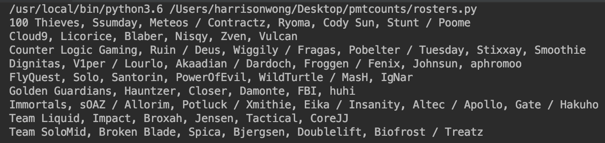
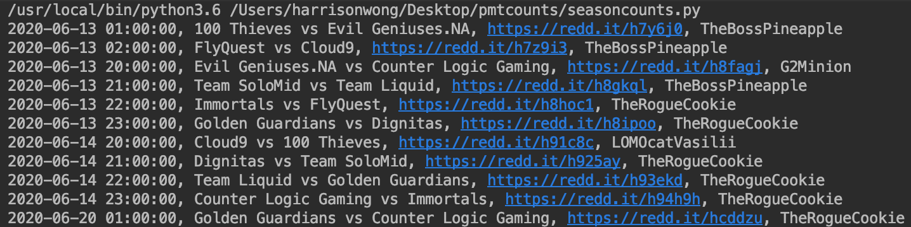

# pmtcounts

---

#### rosters.py

Create rosters spreadsheet

Uses API from https://lol.gamepedia.com to get data

Uses examples from:

https://lol.gamepedia.com/Help:API_Documentation

Other useful documentation:

https://lol.gamepedia.com/Special:CargoTables/TournamentRosters

https://lol.gamepedia.com/Special:CargoTables/Teams

---

#### seasoncounts.py

Count threads by person for end of season

Gets reddit links from Leaguepedia

Gets username from reddit link

----

#### schedule.py

Generates spreadsheet-friendly schedules by season and week

Set playoffs by removing Tab='Week 1' in the `where` query - because playoffs schedule is done by all matches

Uses MatchSchedule table - https://lol.fandom.com/wiki/Special:CargoTables/MatchSchedule

Format is `Date "tab" Eastern "tab" Pacific "tab" CET "tab" Team1 "tab" vs. "tab" Team2`

Uses pytz for timezones

